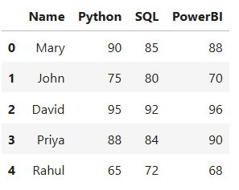
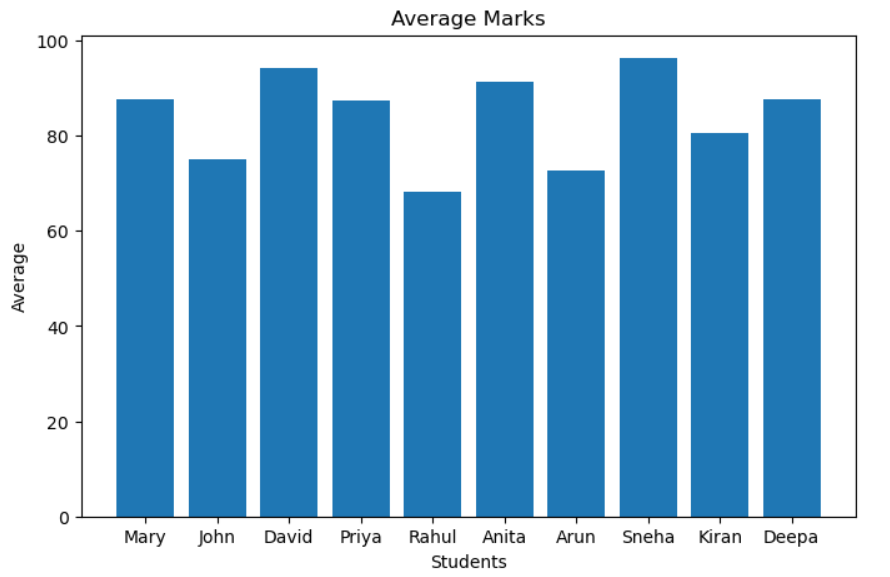
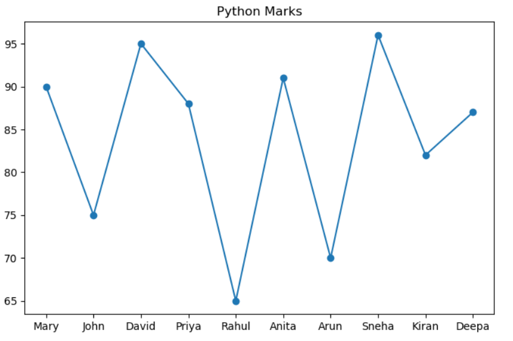
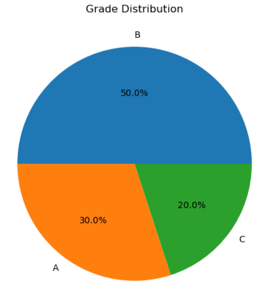
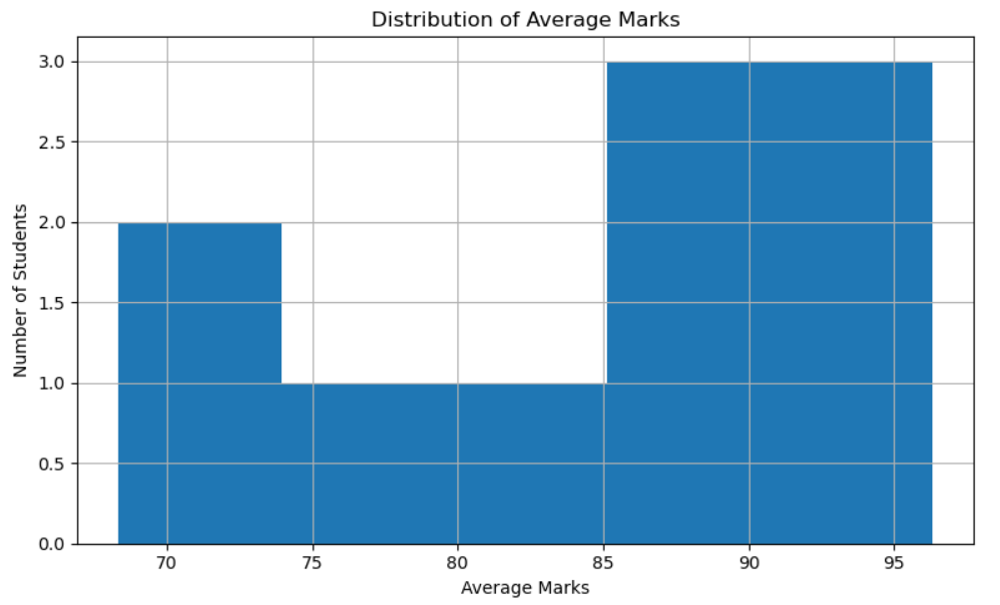

\# 📊 Student Performance Analysis using Python


A Data Analysis project developed using \*\*Python\*\*, \*\*NumPy\*\*, \*\*Pandas\*\*, and \*\*Matplotlib\*\* to analyze student performance data and generate meaningful insights.


\---


\# 📌 Project Overview


This project demonstrates the complete data analysis workflow, including:


\- Loading data from a CSV file

\- Exploring the dataset

\- Performing feature engineering

\- Statistical analysis

\- Data visualization

\- Exporting the processed dataset


\---


\# 📷 Project Preview

\## Dataset Preview



---

\## Average Marks Bar Chart



---

\## Python Marks Line Chart



---

\## Grade Distribution



---

\## Histogram



---


\# 🎯 Objectives


\- Read student data from a CSV file

\- Explore and understand the dataset

\- Calculate Total and Average marks

\- Assign Grades and Student Status

\- Perform statistical analysis

\- Visualize student performance

\- Export the processed dataset


\---


\# 🛠️ Technologies Used


\- Python

\- NumPy

\- Pandas

\- Matplotlib

\- Jupyter Notebook


\---


\# 📂 Project Structure


```text

student-performance-analysis

│

├── data

│   ├── student.csv

│   └── cleaned\_students.csv

│

├── notebook

│   └── student-performance-analysis.ipynb

│

├── screenshots

│   ├── project\_overview.png

│   ├── dataset\_preview.png

│   ├── bar\_chart.png

│   ├── line\_chart.png

│   ├── pie\_chart.png

│   └── histogram.png

│

├── README.md

├── requirements.txt

├── LICENSE

└── .gitignore

```


\---


\# 📊 Dataset


The dataset contains the following columns:


\- Name

\- Python Marks

\- SQL Marks

\- Power BI Marks


The following columns are created during analysis:


\- Total

\- Average

\- Grade

\- Status


\---


\# 📈 Analysis Performed


The project performs:


\- Dataset Exploration

\- Summary Statistics

\- Feature Engineering

\- Student Grade Classification

\- Performance Filtering

\- Sorting

\- Correlation Analysis

\- Data Visualization


\---


\# 📊 Visualizations


The project includes:


\- 📊 Bar Chart

\- 📈 Line Chart

\- 🥧 Pie Chart

\- 📉 Histogram


\---


\# 💡 Key Insights


\- Student averages were successfully calculated.

\- Grades were assigned based on average marks.

\- High-performing students were identified.

\- Performance trends were visualized using charts.

\- The processed dataset was exported successfully.


\---


\# 🚀 Skills Demonstrated


\- Python Programming

\- NumPy

\- Pandas

\- Data Cleaning

\- Feature Engineering

\- Exploratory Data Analysis (EDA)

\- Data Visualization

\- CSV File Handling


\---


\# 📁 Output


The project generates:


\- Processed Student Dataset

\- Performance Summary

\- Statistical Analysis

\- Visualizations


\---


\---

\# ▶️ How to Run

\### 1. Clone the repository

```bash
git clone https://github.com/MaryShaliniJ/student-performance-analysis.git
```

\### 2. Navigate to the project folder

```bash
cd student-performance-analysis
```

\### 3. Install the required libraries

```bash
pip install -r requirements.txt
```

\### 4. Open the notebook

\Launch Jupyter Notebook and open:

```text
notebook/student_performance_analysis.ipynb
```

\### 5. Run all cells

\Execute all cells in the notebook to reproduce the analysis and visualizations.

\---


\# 🔮 Future Improvements


\- Add more subjects

\- Include missing value handling

\- Build an interactive dashboard using Power BI

\- Perform advanced exploratory data analysis


\---


\# 👩‍💻 Author


\*\*Mary Shalini J\*\*


M.E. Computer Science \& Engineering (Big Data Analytics)


\---


⭐ If you found this project useful, feel free to explore the repository.

